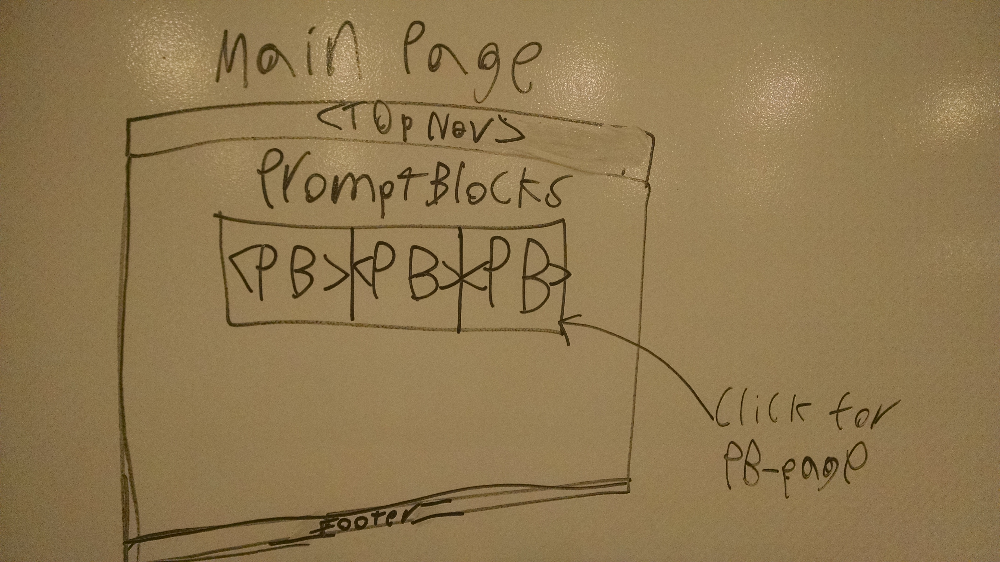
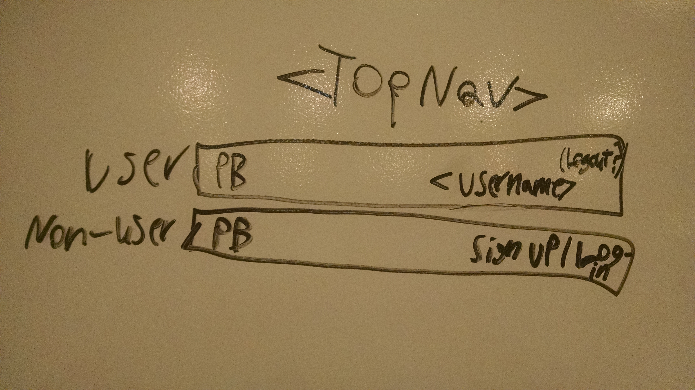
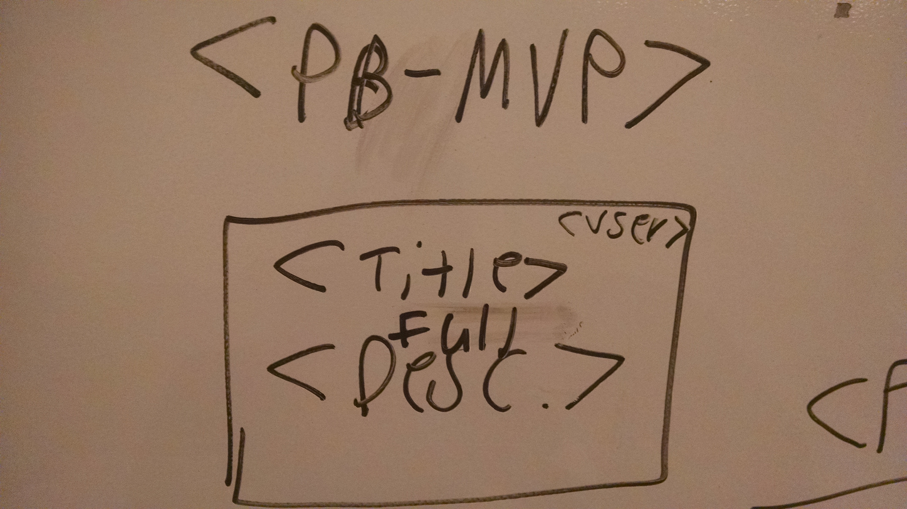
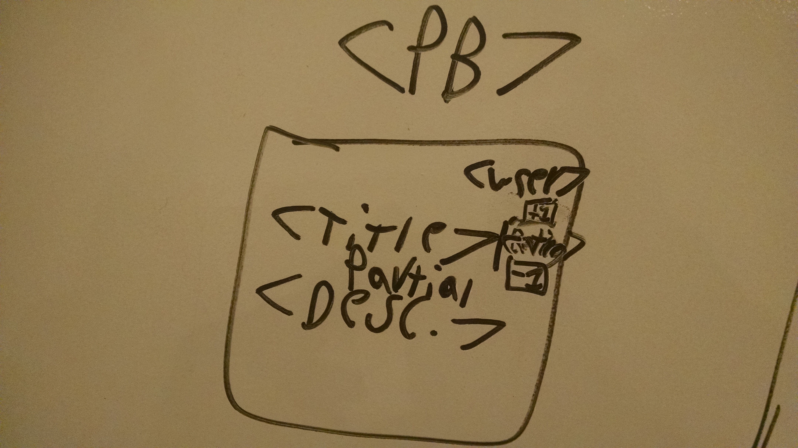
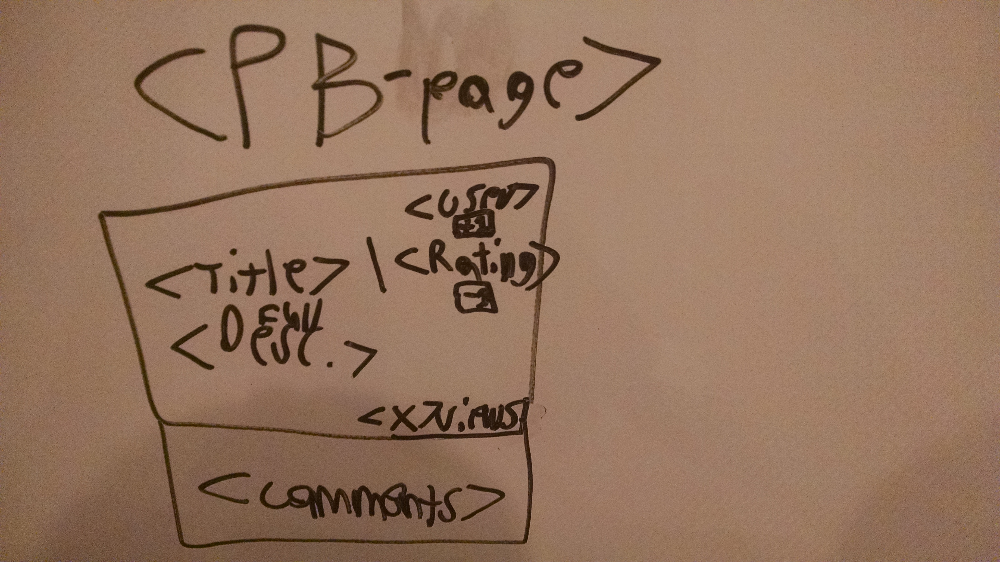

# PromptBlocks

PromptBlocks will be a website where users can get creative prompts for art projects, filmmaking, game development, and more!

## Proposal

I've frequently been stumped about what the next step is for creative projects I've been working on, and I'm sure I'm not alone in feeling that way. PromptBlocks aims to solve that for everyone. Users can upload any prompts they come up with, which will then be formatted and organized into a PromptBlock. A PromptBlock will have the following attributes:

* Info:
  * Title (MVP): The prompt described in less than 140 characters
  * Description (MVP): Additional information on the prompt
  * User (MVP): The submitter of the prompt
  * Comments: Any input one has on a specific prompt
* Stats:
  * Rating: Can be +1'd or -1'd by other users once.
  * Views: Amount of times a PromptBlock's title has been viewed
  * Clicks: Amount of times a PromptBlock has been clicked from a page on the main website

## User stories

* MVP:
  * As a non-user, I want to be able to sign-up and become a user
  * As a non-user, I want to be able to see all PromptBlocks submitted by a specific user
  * As a non-user, I want to be able to visit a page of a single PromptBlock
  * As a user, I want to be able to submit (CREATE) PromptBlocks from any page on the website
  * As a user, I want to be able to be able to view (READ) every PromptBlock that has been submitted to the website
  * As a user, I want to be able to change (UPDATE) PromptBlocks that I've already submitted
  * As a user, I want to be able to remove (DELETE) PromptBlocks that I've already submitted
* Full version:
  * As a user, I should be able to see how my PromptBlocks have been rated
  * As a user, I should be able to see how many times my PromptBlocks have been viewed
  * As a user, I should be able to rate PromptBlocks with a +1 or a -1
  * As a user, I should be able to hide PromptBlocks I've already rated
  * As a user, I should be able to hide PromptBlocks I've already seen
  * As a user, I want to be able to comment on existing PromptBlocks

## ERDs

ERD of MVP database

ERD of full version database

## Wireframes

